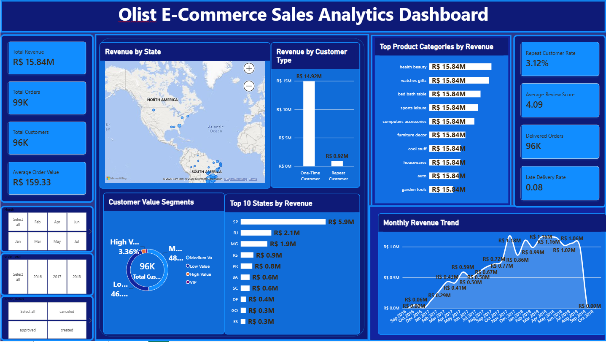

# 🛒 Olist E-Commerce Sales & Customer Analytics

### End-to-End Data Analytics Project | Python • SQL Concepts • Power BI • DAX

An end-to-end e-commerce analytics project built using the **Olist Brazilian E-Commerce dataset** to transform raw transactional data into actionable business insights.

The project covers the complete analytics workflow — from **data profiling and preprocessing in Python** to **data modeling, DAX measures, interactive visualizations, and business intelligence reporting in Power BI**.

---

## 📊 Dashboard Preview



> **Interactive Power BI dashboard designed to monitor sales performance, customer behavior, product performance, geography, and delivery experience.**

---

## 🎯 Business Problem

E-commerce platforms generate large volumes of data across orders, customers, products, sellers, payments, reviews, and deliveries.

However, raw transactional data alone does not provide clear answers to important business questions such as:

- How is revenue changing over time?
- Which states generate the most revenue?
- Who are the highest-value customers?
- How important are repeat customers?
- Which product categories contribute the most revenue?
- Are delivery delays affecting customer satisfaction?
- Which areas require operational attention?

This project addresses these questions by converting multiple raw Olist datasets into a structured analytical solution.

---

# 🚀 Project Objectives

The primary objectives of this project are to:

- Analyze overall e-commerce sales performance
- Monitor revenue and order trends
- Understand customer purchasing behavior
- Identify one-time and repeat customers
- Segment customers based on order frequency and spending
- Identify high-performing product categories
- Analyze geographical revenue distribution
- Measure delivery performance
- Study the relationship between delivery experience and customer reviews
- Build an interactive executive-level Power BI dashboard

---

# 🗂️ Dataset

This project uses the **Olist Brazilian E-Commerce Public Dataset**.

The dataset contains approximately **100K orders** and multiple relational datasets representing different aspects of an e-commerce business.

### Dataset Components

| Dataset | Purpose |
|---|---|
| Orders | Order lifecycle, status and timestamps |
| Customers | Customer identifiers and locations |
| Order Items | Products purchased, prices and freight |
| Payments | Payment methods, values and installments |
| Reviews | Customer review scores and feedback |
| Products | Product attributes and categories |
| Sellers | Seller information and locations |
| Geolocation | Brazilian geographical information |
| Category Translation | Portuguese-to-English category mapping |

---

# 🔄 Analytics Workflow

```text
Raw Olist Datasets
        │
        ▼
Data Loading
        │
        ▼
Data Profiling
        │
        ▼
Data Cleaning & Validation
        │
        ▼
Missing Value Treatment
        │
        ▼
Feature Engineering
        │
        ▼
Dataset Aggregation
        │
        ▼
Exploratory Data Analysis
        │
        ▼
Business Insights
        │
        ▼
Power BI Data Modeling
        │
        ▼
DAX Measures & Calculations
        │
        ▼
Interactive DashboardS